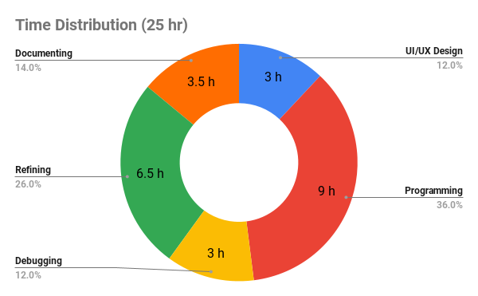

# Employee-Directory
Block’s Mobile [Take-Home Project: an employee directory app](https://square.github.io/microsite/mobile-interview-project/#hello).

## Build tools & versions used
Xcode (Version 14.0 beta 3)

## Steps to run the app
1. git clone https://github.com/garyhsu123/Employee-Directory.git
2. Run **Employee Dictionary.xcodeproj** on Xcode.

## What areas of the app did you focus on?
1. UI/UX Design by [Figma](https://www.figma.com/file/RU8xXPRQUPyxEuGh7RnP7x/Employee-Directory?node-id=9%3A554). 
2. Implement with **MVVM**.
    
    **ViewController.swift** which is the landing page. 
3. Implement Unit Test

## What was the reason for your focus? What problems were you trying to solve?
We can discuss in three aspects according the response from [the last question](#what-areas-of-the-app-did-you-focus-on)

Focus on|Reason|Problems to solve
--------|------|-----------------
UI/UX Design|To understand what really important for the users.|How to priortize the information?
Implement MVVM|<ul><li>To write a extensible and flexible code.</li><li>Be easy to test.</li></ul>| How to separate the business logic and user interface in a good way?
Implement Unit Test|To create reliable code with resiliency.|What units should be tested?
   

## How long did you spend on this project?
Nearly 25 hours in total.


## Did you make any trade-offs for this project? What would you have done differently with more time?
<ol><li>There is one general alert dialogue that will pop out when some error happens during fetching data from the server. 

<p>

 What I miss are handling different error in a different way. For example, ask the user to change the network if there is an [*notConnectedToInternet*](https://developer.apple.com/documentation/foundation/urlerror/2293104-notconnectedtointernet) happens. Or show retry dialogue if request [*time-out*](https://developer.apple.com/documentation/foundation/urlerror/2293002-timedout).
</li>
<li>

Not creating the Unit Test to test the error handling for [Network](https://github.com/garyhsu123/Employee-Directory/blob/main/Employee%20Dictionary/Model/Network.swift) model and lack of the Unit Test to test the local file management for [FileModel](https://github.com/garyhsu123/Employee-Directory/blob/main/Employee%20Dictionary/Model/FileModel.swift).

</li>
</ol>

## What do you think is the weakest part of your project?
I haven't created a way to remove the employees' photos for an employee who isn't on the employee directory. Therefore, the unused photos in the local directory will increase over time.

> My current solution I think of is storing the name of employees in the cache. If there is an employee's name which doesn't exist in the employee directory got from the server, remove his/her photos in the local directory.

## Did you copy any code or dependencies? Please make sure to attribute them here!

```swift
// Generate random string
// https://stackoverflow.com/a/26845710

let letters = "abcdefghijklmnopqrstuvwxyzABCDEFGHIJKLMNOPQRSTUVWXY"

func randomString(length: Int) -> String {
    return String([length].map{ _ in letters.randomElement()! })
}
```
## Is there any other information you’d like us to know?
It's the most interesting developing process I have ever had. In the beginning, I do the user research and get requests from the users. Second, I start creating wireframes and prototypes for the user interface. Afterwards, create the real applications on iPhone.